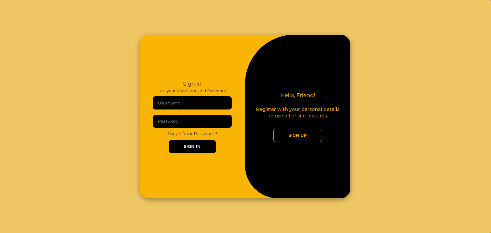
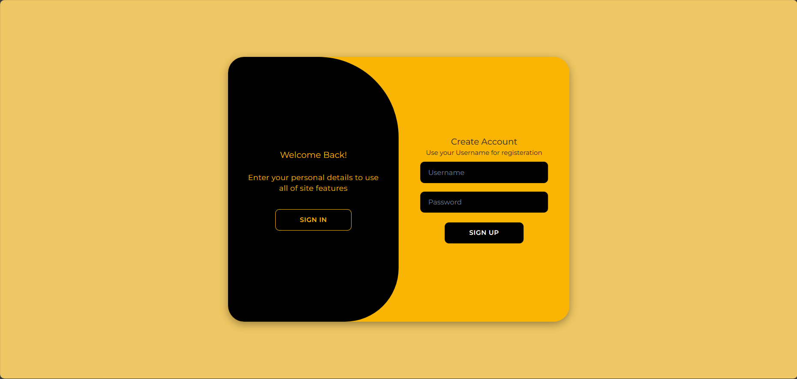
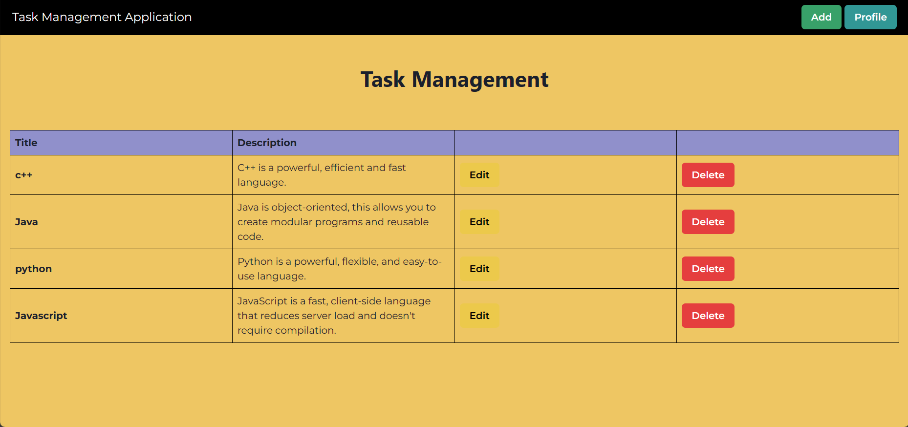

# MERN Stack Task Manager Application

This is a Task Manager application built using the MERN (MongoDB, Express.js, React, Node.js) stack. It allows users to manage tasks, register, and login.

## Features

- CRUD operations on tasks: Users can add, view, update, and delete tasks.
- User authentication: Users can register and login to the application securely.
- Profile management: Users can view and update their profile details.
- Responsive UI: The application is responsive and can be accessed on different devices.

### Landing Page :-

### Register Page

### HomePage

